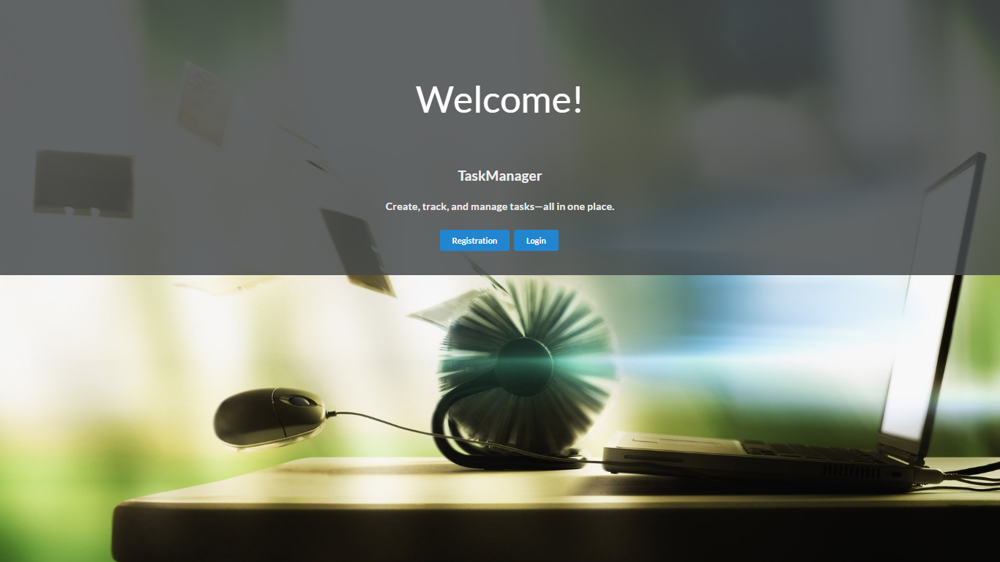
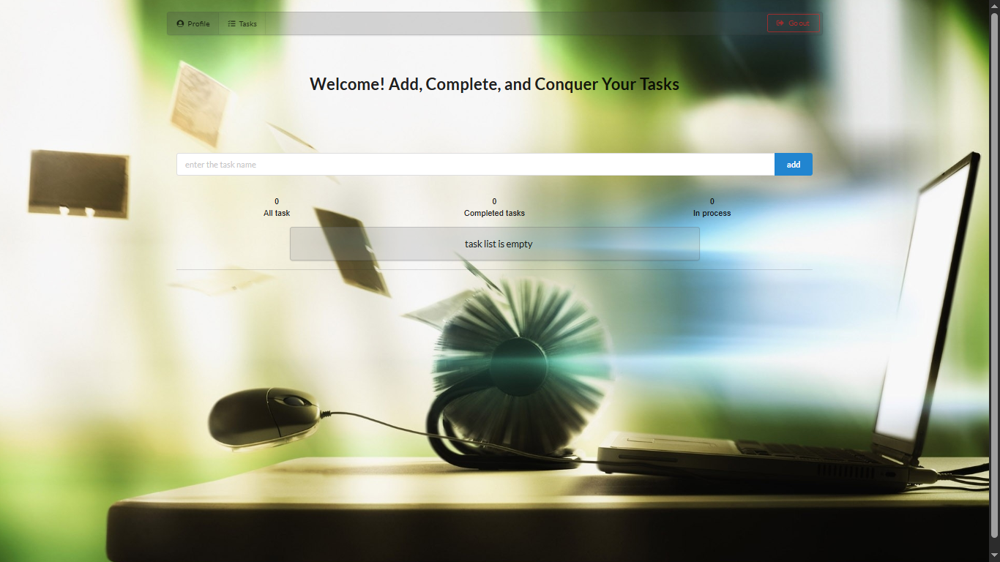
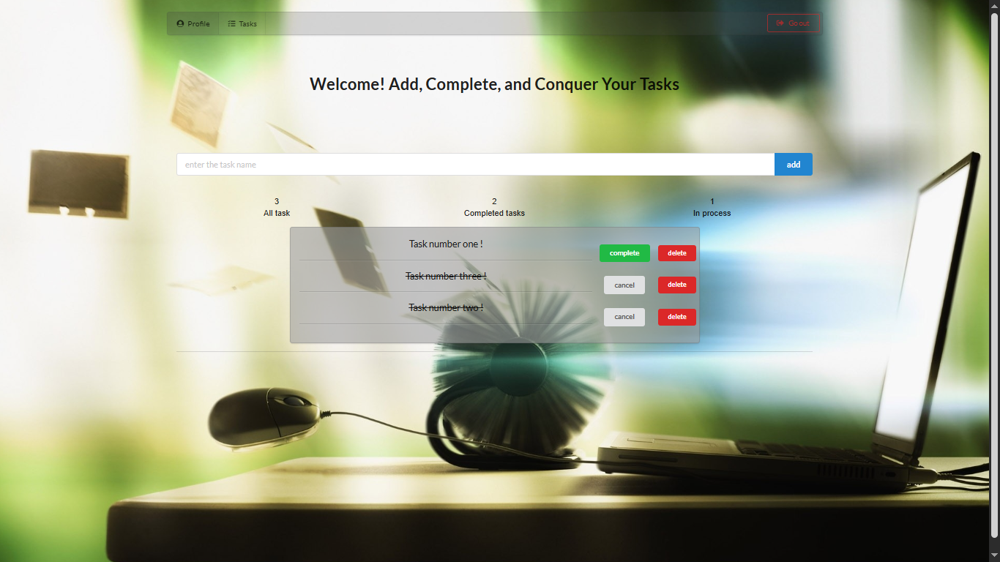
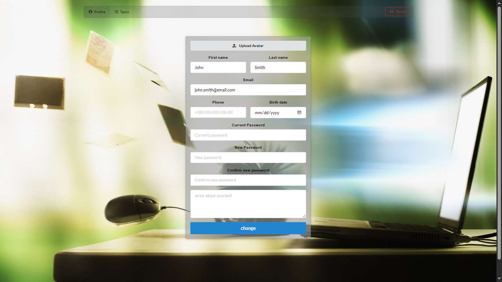
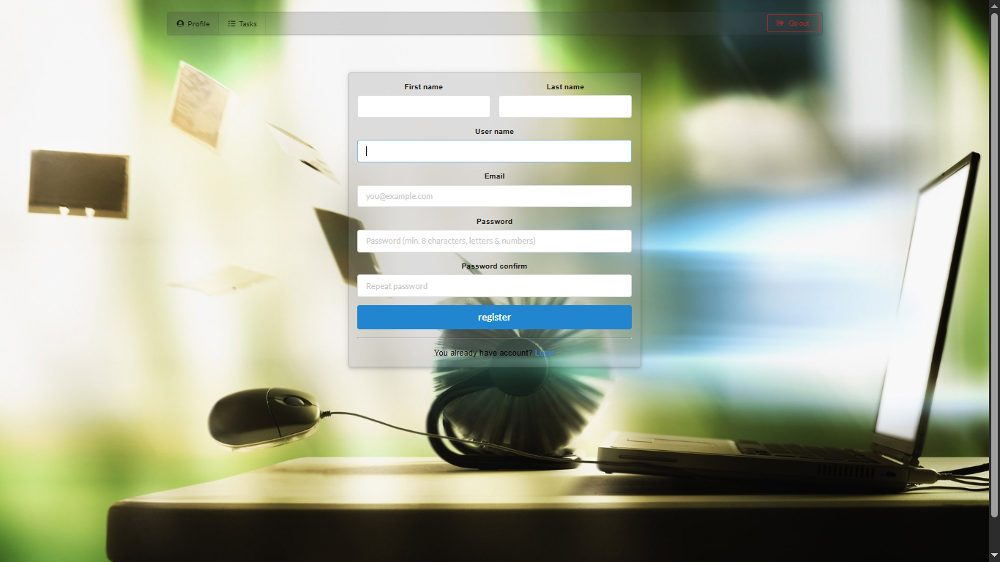
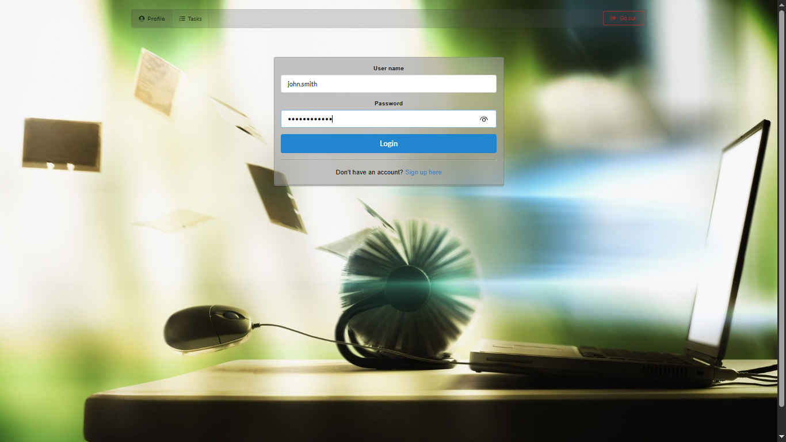
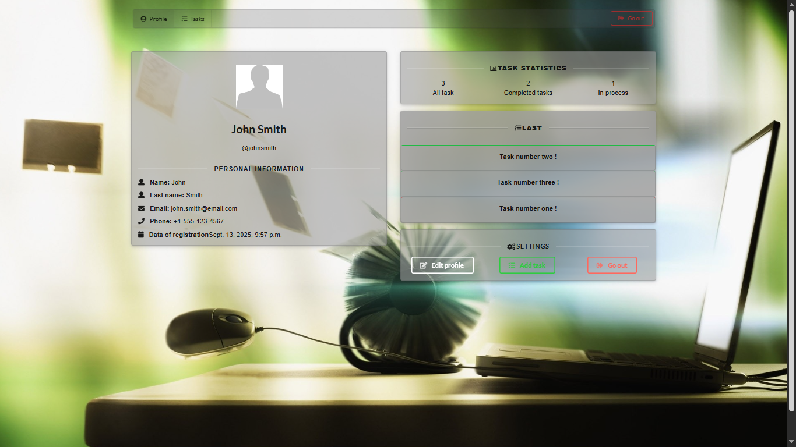

# 📝 Django ToDo List Project

## 📂 Project Structure

```
mysite/
├── accounts/           # User accounts app (registration, login, profile)
│   ├── static/         # App-specific static files (CSS)
│   ├── templates/      # App-specific templates
│   └── migrations/     # Django migrations
├── todolist/           # ToDo list app (tasks, dashboard)
│   ├── static/         # App-specific static files (CSS, JS)
│   ├── templates/      # App-specific templates
│   └── migrations/     # Django migrations
├── media/              # Uploaded media files (avatars)
├── static/             # Project-wide static files (CSS, images)
├── templates/          # Project-wide templates
├── screenshots/        # Project screenshots (see below)
├── db.sqlite3          # SQLite database (ignored by git)
├── manage.py           # Django management script
└── requirements.txt    # Python dependencies
```

## 🚀 Features
- User registration, login, and profile management
- Avatar upload and profile editing
- Task dashboard: add, edit, delete, and view tasks
- Responsive UI with custom CSS

## 🖼️ Screenshots
Screenshots of the application are available in the `screenshots/` folder:

| Landing Page | Task Dashboard | Task Management |
|:------------:|:--------------:|:---------------:|
|  |  |  |

| Profile Editor | User Registration | User Login | User Profile |
|:--------------:|:----------------:|:----------:|:------------:|
|  |  |  |  |

## ⚙️ Quick Start
1. **Clone the repository:**
   ```sh
   git clone <your-repo-url>
   cd mysite
   ```
2. **Install dependencies:**
   ```sh
   pip install -r requirements.txt
   ```
3. **Apply migrations:**
   ```sh
   python manage.py migrate
   ```
4. **Run the development server:**
   ```sh
   python manage.py runserver
   ```
5. **Open in browser:**
   Visit [http://127.0.0.1:8000/](http://127.0.0.1:8000/)

## 🙌 Contributing
Pull requests are welcome! For major changes, please open an issue first to discuss what you would like to change.

## 📄 License
This project is licensed under the MIT License. See the [LICENSE](LICENSE) file for details.